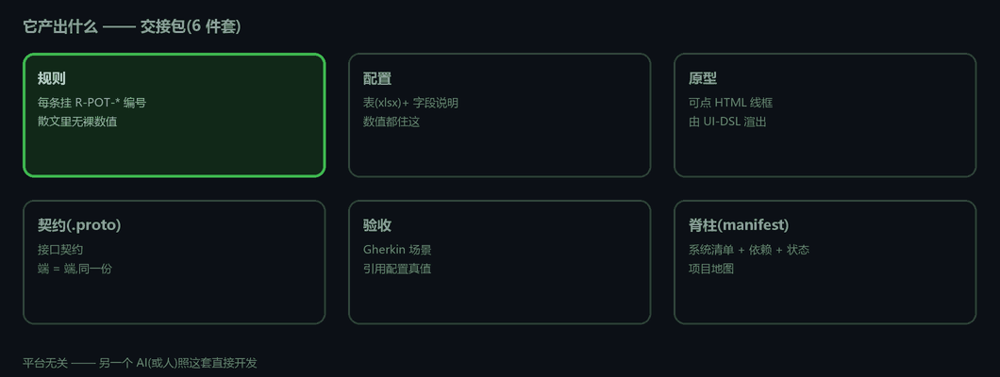
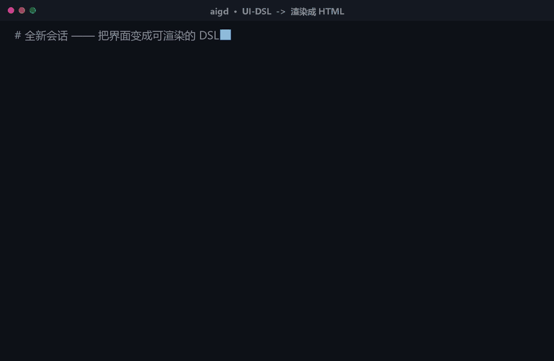
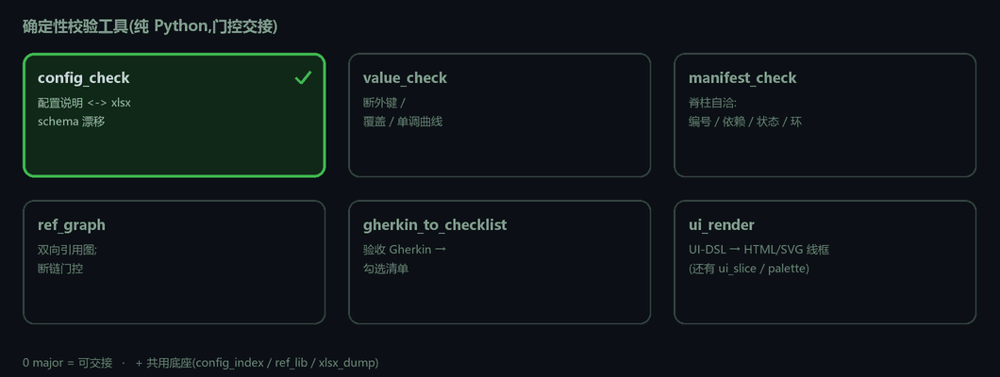
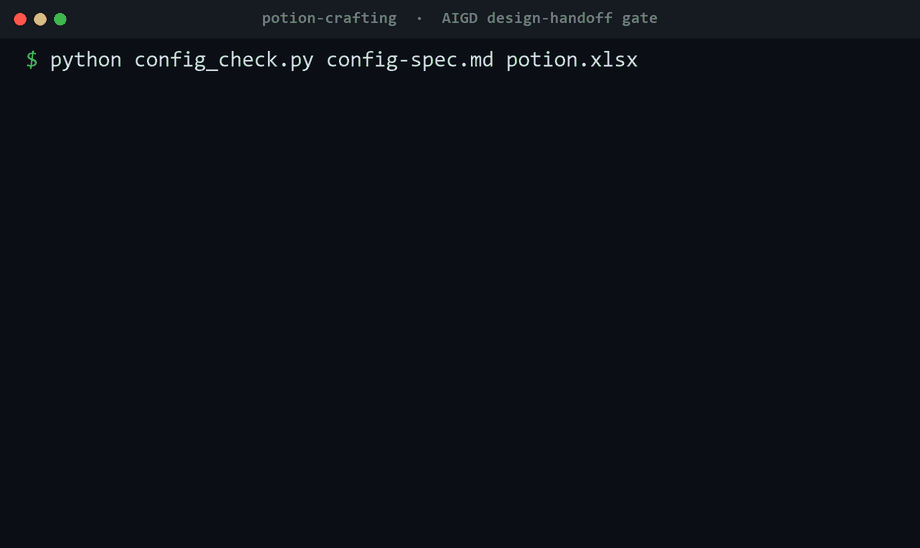

# AIGD — AI 辅助游戏设计方法论（可移植 skill 包）

*和一个 AI 头脑风暴做游戏设计,产出物可交给另一个 AI 直接开发落地——自带确定性校验器,交接包没过门就放不出去。*

> 🌐 English version: **[ProdaZhang/aigd](https://github.com/ProdaZhang/aigd)**


**它解决什么:** 游戏设计交接最常翻车的是**文档与配置悄悄失同步**——下游各读各的、实现分叉。AIGD 把设计结构化到漂移无处可藏(规则挂编号、数值住配置、散文只引 `表[主键].字段`),并自带**确定性校验器**,把交接包门控到 *0 major* 才放行。

讨论驱动 · 不替你拍数值 · 不绑定引擎。

> **这是仓库落地页。** 先跑通感受一下 → [`aigd/examples/potion-crafting/`](aigd/examples/potion-crafting/);完整方法论 → [`aigd/README.md`](aigd/README.md)。

---

## 它解决什么

游戏设计交接最常翻车的不是文档写得少,而是**文档与配置悄悄失同步**("文档先定、表格后改没回写"),下游各读各的 → 实现分叉。AIGD 三招挡住:结构化产出(规则挂编号 / 数值住配置 / 散文只引 `表[主键].字段`)、未定的显式挂账(`[待确认]` 交人拍板)、确定性机检(`config_check`/`value_check`/`manifest_check`,0 major 才算可交接)。

## 另一个 AI 真能照着建——还过验收


<sub>↑ **真跑**:只读示例交接包从零实现,5 条验收场景全过(`5 passed, 0 failed`)。</sub>

## 你产出什么——交接包(6 件套)



## 界面:DSL 渲染成可点原型



## 门控它的确定性校验器





<sub>↑ `config_check` **真跑**:抓出文档↔配置失同步(`UNDOC_COL`),改回后才放行。</sub>

## 装(7 个文件夹,不多不少)

把这 7 个文件夹整体拷进宿主的 skills 目录,保持**平级**:

```text
aigd/  aigd-concept/  aigd-system/  aigd-iterate/  aigd-handoff/  aigd-sync/  aigd-ui-capture/
```

| harness | 装到 |
|---------|------|
| Claude Code | `.claude/skills/` |
| ZCode（Claude 系） | `~/.zcode/skills/` |
| Gemini CLI | `~/.gemini/skills/`(或 `gemini skills install https://github.com/<owner>/<repo>` 一键从仓库装) |
| Codex | `~/.codex/skills/<名>`(或自带 skill-installer 从仓库装;装完重启) |
| Copilot CLI 1.0.63 | ❌ 无 skills 机制,走 `AGENTS.md`/MCP/plugin,需适配 |

包结构(`SKILL.md` + `name`/`description` frontmatter)在 **Claude Code / ZCode / Gemini / Codex** 通用(均已实测);**Copilot 1.0.63 不支持**。装哪/怎么唤起/工具名对应见 [`aigd/references/harness适配.md`](aigd/references/harness适配.md)。跑校验器要 Python(多数纯标准库;部分要 `openpyxl`/`Pillow`,见 `aigd/references/scripts/requirements.txt`)。

## 上手

1. 装好 7 个文件夹。
2. 读 [`aigd/README.md`](aigd/README.md) 了解 6 件套 + 流程。
3. 跑 [`examples/potion-crafting/`](aigd/examples/potion-crafting/) 的三条校验命令,看"机检门控"实际效果。
4. 新项目:调 `aigd`(不知在哪步就让它路由)或直接 `aigd-concept` 立意 → `aigd-system` 逐系统 → `aigd-handoff` 定稿。

---

## 适用边界（它不是什么）

诚实划范围,免得用错:

- **管结构与一致性,不管平衡**:校验器查断链/覆盖/单调/schema 漂移,**不评判数值好不好玩**——平衡是人/专项工具的事。
- **html 原型验信息架构与流程,验不了手感/时序/网络**:对 UI 密集系统(背包/商城/养成)够用;实时战斗/物理/多人交互这类"感觉",留给工程原型或专项验证,别拿可点线框当手感已验。
- **不替你拍数值/口径**:未定的一律标 `[待确认]` 交人,AI 不脑补。
- **"另一个 AI 能照交接包开发"的证据范围**:在**同模型族**(Claude)真系统上做过消费端双实现交叉验证、跑通;**跨厂模型(GPT/Gemini)未验**。它是强证据、不是全称证明。

## 跨 harness 现状（实测，2026-06-23）

| harness | 装入 | 发现 | 路由 | 执行 |
|---------|------|------|------|------|
| Claude Code（原生·真项目） | ✅ | ✅ | ✅ | ✅ |
| ZCode 3.1.3（Claude 系） | ✅ | ✅ | ✅ | ✅ |
| Gemini CLI 0.47（Google·跨厂） | ✅ | ✅ | ✅ | ✅ |
| Codex 0.140（OpenAI·跨厂） | ✅ | ✅ | ✅ | ✅ |
| Copilot CLI 1.0.63（GitHub） | ❌ 无 skills 机制 | — | — | — |

四个 harness 实测跑通(发现 + 路由 + 执行),**含 Gemini、Codex 两个跨厂**;Gemini 用 `gemini skills install <repo>`、Codex 用自带 skill-installer 都能从本仓库一键装。**Copilot CLI 1.0.63 经实测不支持 SKILL.md skills 机制**(走 AGENTS.md/MCP/plugin),aigd 需适配才能用。装哪/怎么唤起见 [`aigd/references/harness适配.md`](aigd/references/harness适配.md)。

## 许可

[MIT](LICENSE) © 2026 ProdaZhang。自由使用 / 修改 / 再分发,保留版权与许可声明即可。

## 状态

v0(预发布)。`patterns/` 是会长大的启动包(目前:5 种核心循环 / 战斗单位养成范式 / 10 条数值陷阱)。校验器测试见 `aigd/references/scripts/tests/`(纯 stdlib runner)。贡献见 [`CONTRIBUTING.md`](CONTRIBUTING.md)。
